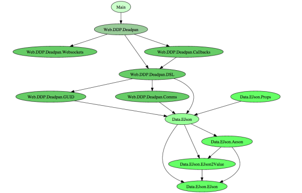

% Deadpan-DDP
% Lyndon Maydwell
% MHUG - January 29, 2015

# Deadpan-DDP

## Presentation Concluded

<http://www.meetup.com/Melbourne-Haskell-Users-Group/events/219608241/>

## On GitHub

<https://github.com/sordina/Deadpan-DDP#deadpan-ddp> 

## On Hackage

<https://hackage.haskell.org/package/Deadpan-DDP> 

## Binary Downloads

<https://github.com/sordina/Deadpan-DDP#binaries>

# Deadpan

## What is Deadpan?

Deadpan is a Haskell DDP client.

## Why do I care?

Becuase it lets you talk to DDP servers!

# DDP

## What is DDP?

[DDP](https://github.com/meteor/meteor/blob/devel/packages/ddp/DDP.md)
is the protocol that [Meteor.js](http://meteor.com) applications speak.

It is a protocol that speaks EJSON over Websockets asynchronously.

Subscriptions are made and retired using this protocol.

## Why do I care?

People have written Meteor applications...

You may wish to interact with them from your Haskell programs.

# EJSON

## What is EJSON?

EJSON is just JSON with a special way of interpreting specially constructed objects.

## Why do I care?

EJSON makes it easy to represent

* Dates
* Binary Data
* User-defined types

## Definition

		data EJsonValue
			= EJObject !(Data.HashMap.Strict.HashMap Text EJsonValue)
			| EJArray  !(Data.Vector.Vector EJsonValue)
			| EJString !Text
			| EJNumber !Scientific
			| EJBool   !Bool
			| EJDate   !EpochTime
			| EJBinary !ByteString
			| EJUser   !Text !EJsonValue
			| EJNull deriving (Eq)

## Notice

This is very similar to Aeson's "Value" type.

## Value Definition

		-- Defined in ‘aeson-0.7.0.6:Data.Aeson.Types.Internal’

		data Value
			= Object !Object
			| Array !Array
			| String !Text
			| Number !Scientific
			| Bool !Bool
			| Null

## Bijection

We can go back and forward between JSON and EJSON:

		ejson2value :: EJsonValue -> Value
		ejson2value (EJObject h    ) = Object (Data.HashMap.Strict.map ejson2value h)
		ejson2value (EJArray  v    ) = Array  (Data.Vector.map ejson2value v)
		ejson2value (EJString t    ) = String t
		...

		value2EJson :: Value -> EJsonValue
		value2EJson (Object o) = escapeObject o
		value2EJson (Array  a) = EJArray $ Data.Vector.map value2EJson a
		value2EJson (String s) = EJString s
		...

## No Maybes

Failing to parse EJSON just returns whatever the literal JSON would be.

# Websockets

## What are websockets?

They are a persistant, bi-directional message conduit between client and server.

Very similar to a regular socket - Thus the name.

## Why do I care?

A persistant connection means that for longer lived applications, there is less
of a sense of reconstructing temporal flow out of stateless requests. This isn't
always the best way to do things, but for some situations it can make sense.

You can envision a websocket based application as a conversation, rather than
a sequence of request/responses.

DDP uses websockets for its communication mechenism.

## Asynchronous

An important side-effect is that the server may send data to the client
without waiting for a request, or a response Res1 corresponding to a
request Req1 my be sent after requests Req2, Rec3, Rec4.

# The Library

## Modules

# The Deadpan Datatype

## `DeadpanApp`?

DeadpanApp is a monadic DSL that makes the high-level actions of a DDP application
available to users through several conveniently defined functions.

## Example: RPC

    clientRPCMethod :: Text
                    -> [EJsonValue]
                    -> GUID
                    -> Maybe Text
                    -> DeadpanApp ()

## Subscription

    subscribe :: Text
              -> [ EJsonValue ]
              -> DeadpanApp GUID

## Blocking

    subscribeWait :: Text
                  -> [EJsonValue]
                  -> DeadpanApp (Either EJsonValue
                                        EJsonValue)

## Implementation

    subscribeWaitId name params = do
      mv      <- liftIO newEmptyMVar
      subId   <- newID
      handleL <- setMatchHandler (guid2NoSub    subId) (handlerL mv)
      handleR <- setMatchHandler (guid2SubReady subId) (handlerR subId mv)
      _       <- clientDataSub subId name params
      res     <- liftIO $ readMVar mv

      deleteHandlerID handlerIdR
      deleteHandlerID handlerIdL
      return res

# Stateful Behavior

## Where we at?

Since a DDP app is inherently communicating in a stateful context,
`DeadpanApp` is actually just a thin wrapper over `StateT IO`.

The applications state is defined as `AppState`:

    data AppState cb = AppState
      { _callbackSet :: Lookup cb
      , _collections :: EJsonValue
      , _connection  :: Websocket.Connection }

With the cb parameter being set to... `DeadpanApp`.

# Lenses

## Data-Actions

Example:

    forOf_ _Just seed $ \v -> modify (("seed", ejstring v):)

# Running DeadpanApp

## How do I run my App?

`Web.DDP.Deadpan` provides functions for running your application:

    runPingClient :: Params
                  -> DeadpanApp a
                  -> IO a

Would be the most common.

# Example

## Show me more!

    {-# LANGUAGE OverloadedStrings #-}

    module SimpleClient where

    import Web.DDP.Deadpan

    main = either print
                  (go app)
                  (getURI "http://localhost:3000/websocket")

    go app params = runPingClient params (logEverything >> app)

    app = do void $ liftIO getLine
             rpcWait "realMethod" []
             void $ liftIO getLine
             rpcWait "missingMethod" []
             void $ liftIO getLine

# Debugging App

## `deadpan`

A command-line app `deadpan` is built alongside this library.

    > deadpan
    Usage: deadpan [-h | --help]
                   [ ( -v | --version ) ( V1 | Vpre2 | Vpre1 ) ]
                   <URL>

This will connection to a DDP server, respond to pings, and print all incomming messages.

EJSON entered will be sent as a message to the server.

## In Action

Demonstrating the debugging app:

    > deadpan websocket://localhost:3000/websocket
    {"server_id":"0"}
    {"msg":"connected","session":"9EccYbEWeePEHLJRb"}
    {"collection":"x","msg":"added","id":"qdfJ","fields":{"name":"A","i":2}}
    {"collection":"x","msg":"added","id":"KM9T","fields":{"name":"B","i":8}}
    {"collection":"x","msg":"added","id":"zeM8","fields":{"name":"C","i":3}}
    {"collection":"x","msg":"added","id":"HrEG","fields":{"name":"D","i":4}}
    ...

## In Action

Demonste the TODO GUI Client.

> runhaskell TodoGui.hs

## TODO

* Add full minimongo capabilities for data modification
* Use more qualified imports, including for internal imports
* Narrow package dependency versions
* Random number generation as-per the spec
* Adopt a more layered aproach (see doc/dot.png)
* Use proper opt-parser for main module
* Try out an auth example
* Allow for intermittent connection to the server
* Execption Handling
* Rename DeadpanApp to App?

# Thanks

## For Attending

Meetup Link:

<http://www.meetup.com/Melbourne-Haskell-Users-Group/events/219608241/>
